## Step 1. Create S3 buckets and upload a sample object in us-east-2


- source-2
- source-2-resized

Step 2. Create the IAM policy
Create an IAM policy that defines the permissions for the Lambda function. The function must have permissions to:

Get the object from the source S3 bucket.

Put the resized object into the target S3 bucket.

Write logs to Amazon CloudWatch Logs.

To create an IAM policy

Open the [Policies](https://console.aws.amazon.com/iam/home#/policies) page in the IAM console.

Choose Create policy.
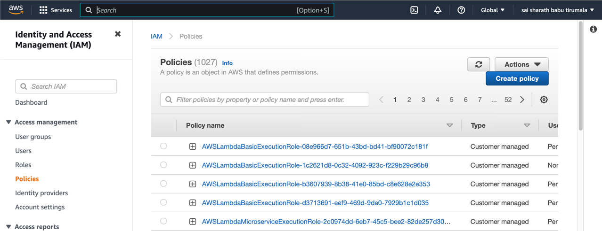
Choose the JSON tab, and then paste the following policy. Be sure to replace 'source-2' with the name of the source bucket that you created previously.

```asciidoc

{
    "Version": "2012-10-17",
    "Statement": [
        {
            "Effect": "Allow",
            "Action": [
                "logs:PutLogEvents",
                "logs:CreateLogGroup",
                "logs:CreateLogStream"
            ],
            "Resource": "arn:aws:logs:*:*:*"
        },
        {
            "Effect": "Allow",
            "Action": [
                "s3:GetObject"
            ],
            "Resource": "arn:aws:s3:::source-2/*"
        },
        {
            "Effect": "Allow",
            "Action": [
                "s3:PutObject"
            ],
            "Resource": "arn:aws:s3:::source-2-resized/*"
        }
    ]
}

```

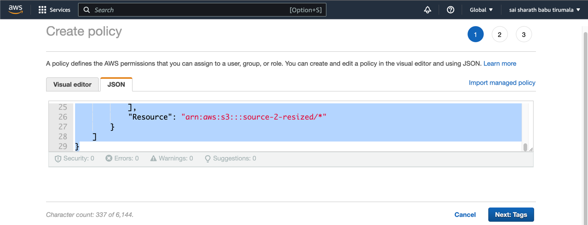
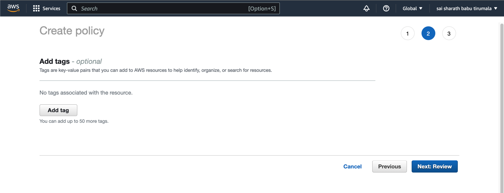

Policy Name :: AWSLambdaS3Policy

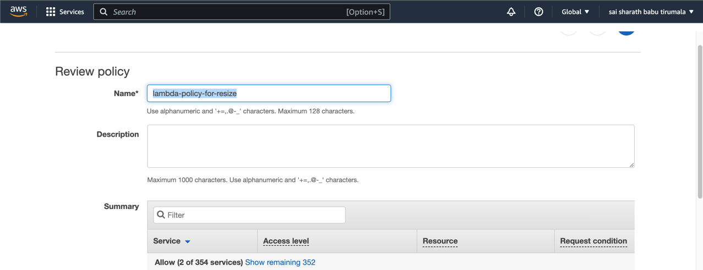

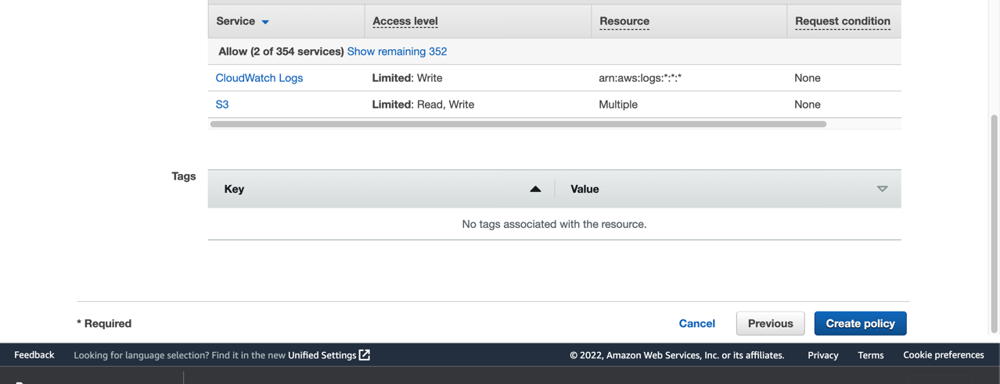

Click on Create Policy.
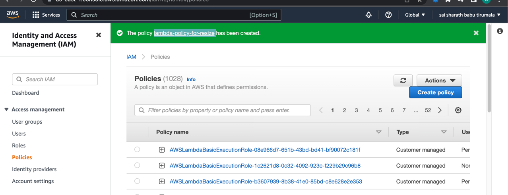


### Step 3. Create the execution role
Create the [execution role](https://docs.aws.amazon.com/lambda/latest/dg/lambda-intro-execution-role.html) that gives your Lambda function permission to access AWS resources.

To create an execution role

Open the Roles page in the IAM console.

Choose Create role.

Create a role with the following properties:

Trusted entity – Lambda
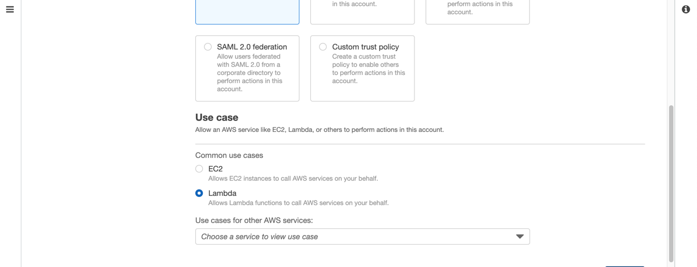
Permissions policy – AWSLambdaS3Policy
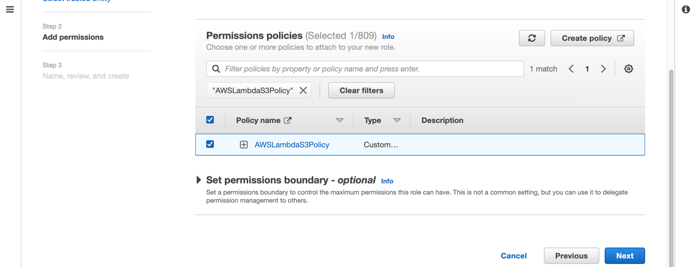
Role name – lambda-s3-role
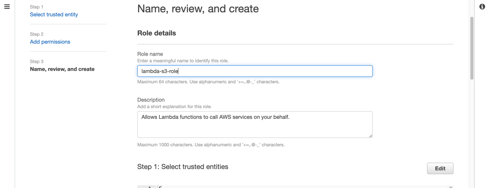

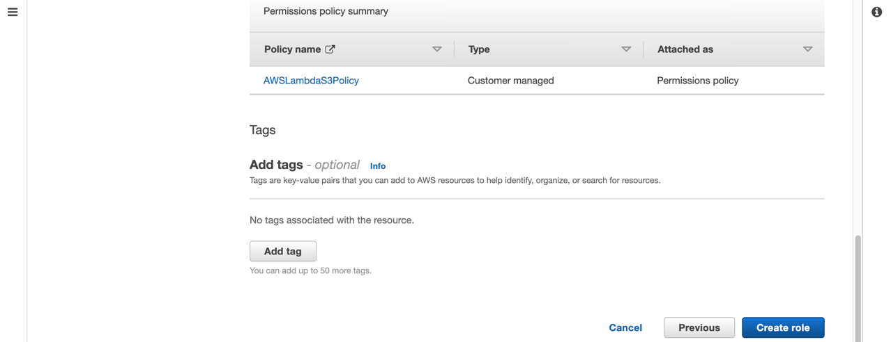

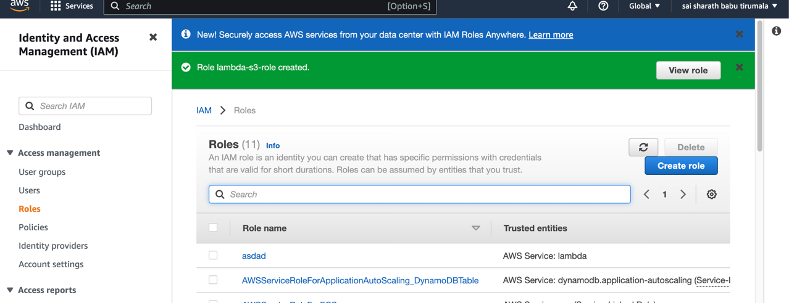

### Step 4. Create the deployment package
The deployment package is a .zip file archive containing your Lambda function code and its dependencies.


```asciidoc
sam build --use-container
```
Build the deployment package. The --use-container flag is required. This flag locally compiles your functions in a Docker container that behaves like a Lambda environment, so they're in the right format when you deploy them.


### Step 5.  Create the Lambda function
```
sam deploy --guided
```

### Step 6. Test the Lambda function Locally
Copy the lambda name from Lambda

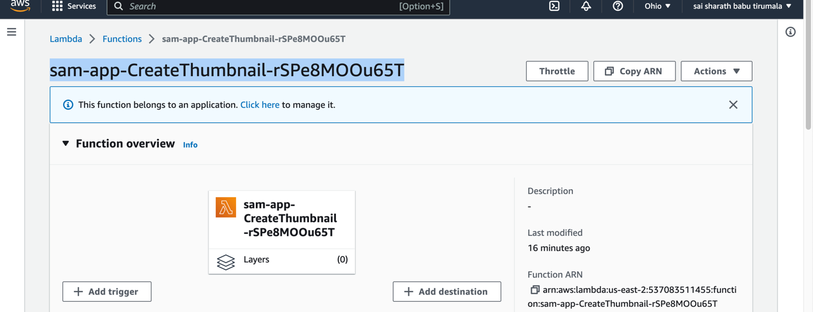
```asciidoc
aws lambda invoke --function-name sam-app-CreateThumbnail-rSPe8MOOu65T \
  --invocation-type Event \
  --payload file://inputFile.txt outputfile.txt

```

### Step 7. Configure Amazon S3 to publish events

Complete the configuration so that Amazon S3 can publish object-created events to Lambda and invoke your Lambda function. In this step, you do the following:

Add permissions to the function access policy to allow Amazon S3 to invoke the function.

Add a notification configuration to your source S3 bucket. In the notification configuration, you provide the following:

The event type for which you want Amazon S3 to publish events. For this tutorial, specify the s3:ObjectCreated:* event type so that Amazon S3 publishes events when objects are created.

The function to invoke.

To add permissions to the function policy

Run the following add-permission command to grant Amazon S3 service principal (s3.amazonaws.com) permissions to perform the lambda:InvokeFunction action. Note that Amazon S3 is granted permission to invoke the function only if the following conditions are met:

An object-created event is detected on a specific S3 bucket.

The S3 bucket is owned by your AWS account. If you delete a bucket, it is possible for another AWS account to create a bucket with the same Amazon Resource Name (ARN).


```asciidoc

aws lambda add-permission --function-name sam-app-CreateThumbnail-rSPe8MOOu65T --principal s3.amazonaws.com \
--statement-id s3invoke --action "lambda:InvokeFunction" \
--source-arn arn:aws:s3:::source-2 \
--source-account 537083511455

```

Verify the function's access policy by running the get-policy command.

```asciidoc
aws lambda get-policy --function-name sam-app-CreateThumbnail-rSPe8MOOu65T
```


To configure notifications

Open the [Amazon S3 console](https://console.aws.amazon.com/s3).

Choose the name of the source-2 S3 bucket.

Choose the Properties tab.

Under Event notifications, choose Create event notification to configure a notification with the following settings:
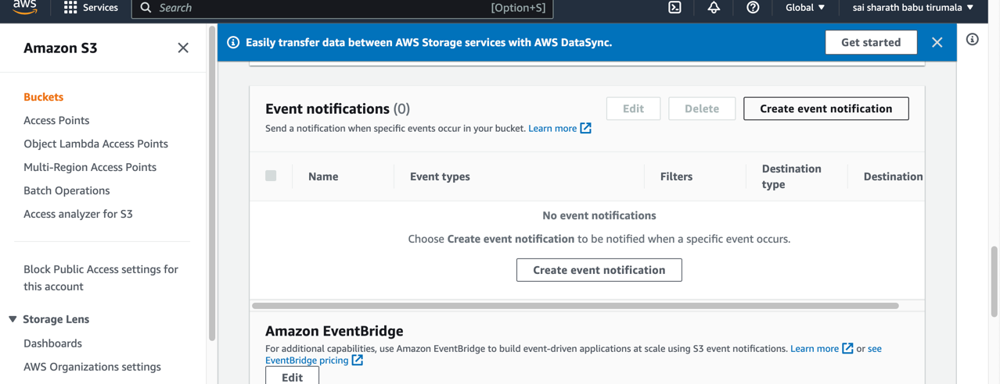
Event name – lambda-trigger
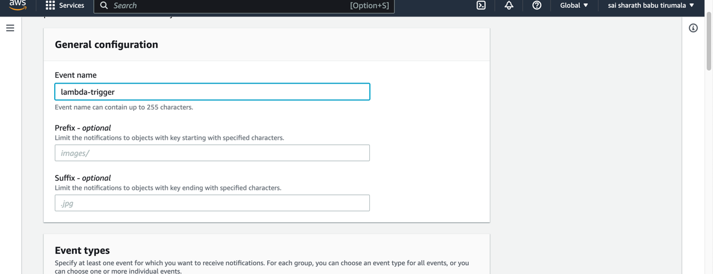
Event types – All object create events
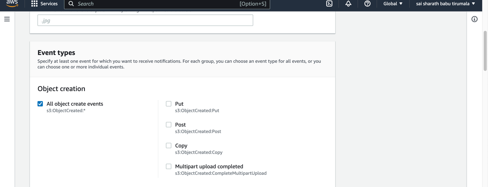
Destination – Lambda function

Lambda function – CreateThumbnail.
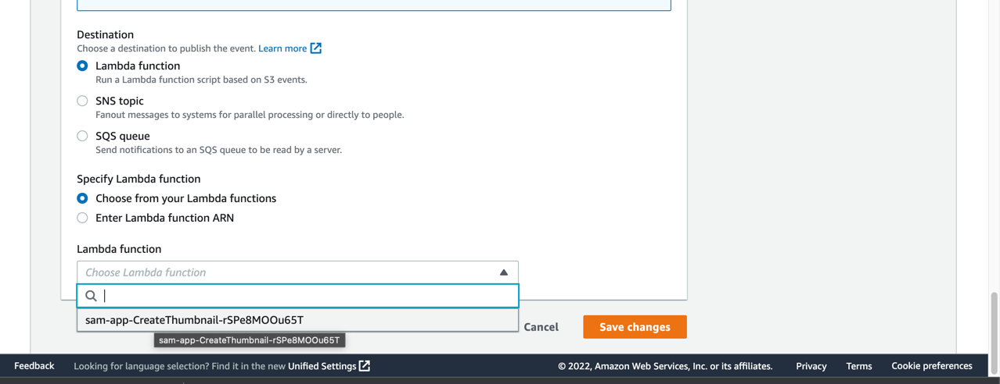
For more information on event configuration, see Enabling and configuring event notifications using the Amazon S3 console in the Amazon Simple Storage Service User Guide.
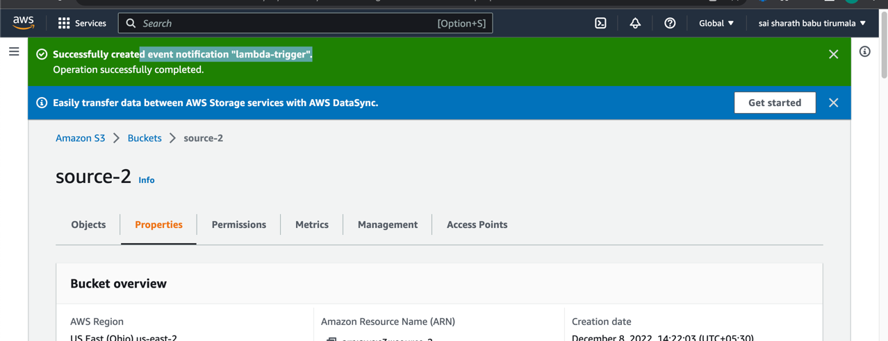
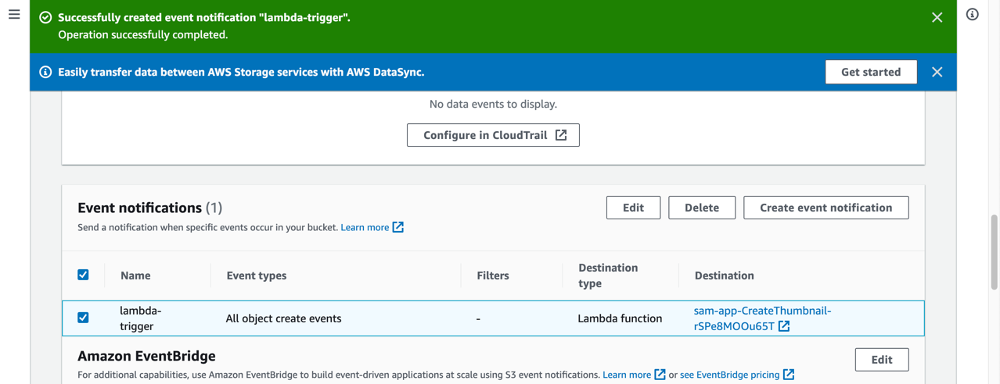

### UPLOAD AN IMAGE AND TEST IT
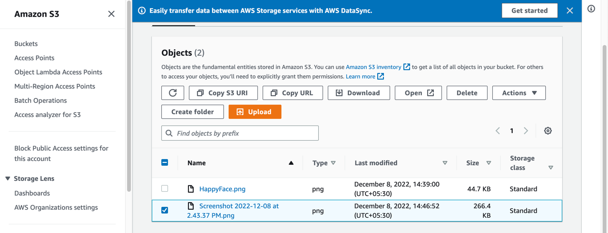


### DELETE ALL RESOURCES, ROLES


Delete both source-2 source-2-resized buckets


Delete IAM Policy AWSLambdaS3Policy


Delete Role lambda-s3-role

